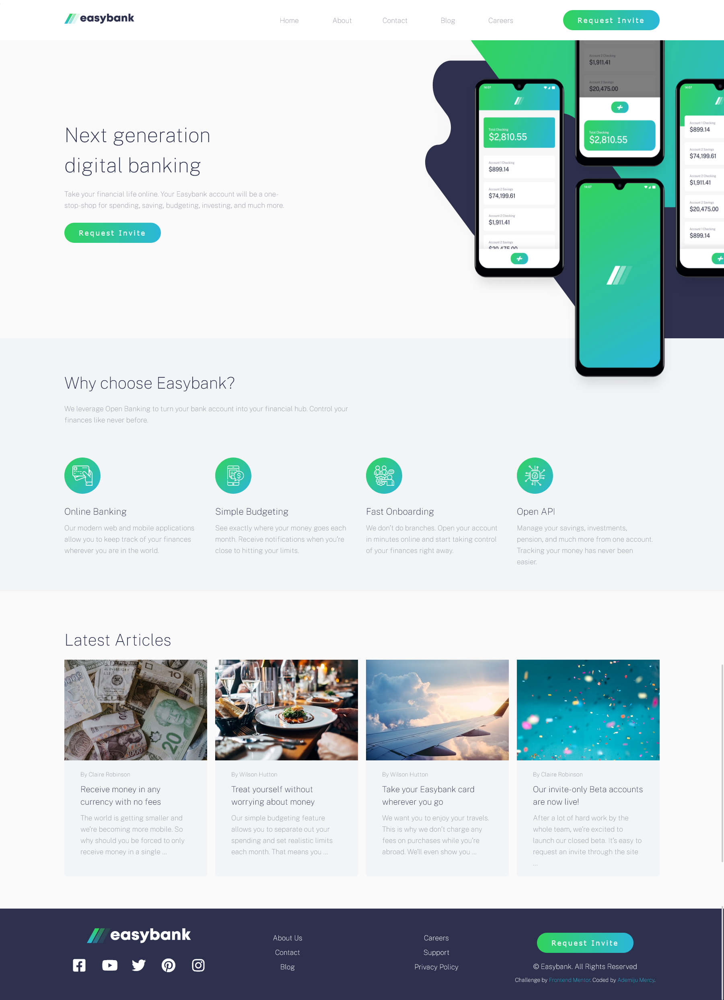

# Frontend Mentor - Easybank landing page

## The challenge

Your challenge is to build out this landing page and get it looking as close to the design as possible.

### Stack
- HTML  
- CSS 
- JS

Users should be able to:

- View the optimal layout for the site depending on their device's screen size
- See hover states for all interactive elements on the page
